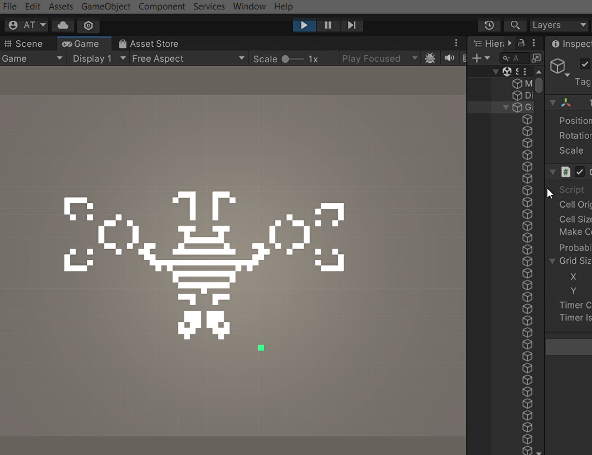
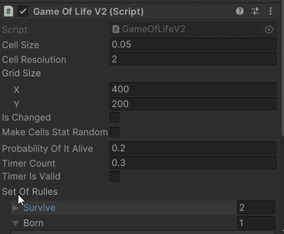

# GameOfLife_Unity


## Overview

This project is a Unity implementation of Conway's Game of Life, a classic cellular automaton devised by the mathematician John Horton Conway. 

## Cellular Automata

Cellular automata are discrete, abstract computational systems that have proved useful both as general models of complexity and as more specific representations of non-linear dynamics in a variety of scientific fields. The Game of Life is one of the most well-known cellular automata. It consists of a grid of cells which, based on a few mathematical rules, can live, die, or multiply. Depending on the initial conditions, the cells form various patterns throughout the course of the game.


## Conway's Game of Life

Conway's Game of Life is a zero-player game, meaning that its evolution is determined by its initial state, requiring no further input. One interacts with the Game of Life by creating an initial configuration and observing how it evolves. The game takes place on a grid of square cells. Each cell is in one of two possible states, alive or dead. Every cell interacts with its eight neighbors, which are the cells that are directly horizontally, vertically, or diagonally adjacent.

The rules of the game are simple:
1. **Survival:** A living cell with two or three live neighbors stays alive.
2. **Death:** A living cell with fewer than two live neighbors dies (underpopulation). A living cell with more than three live neighbors dies (overpopulation).
3. **Birth:** A dead cell with exactly three live neighbors becomes a live cell (reproduction).

## Project Implementation

This project has two versions of the Game of Life implementation:

### Version 1 (V1)

- **Cells as GameObjects**: Each cell is represented as an individual GameObject.
- **Rendering and Performance Issues**: This approach encountered performance problems, particularly with rendering and frame rates, due to the large number of GameObjects being processed individually.

### Version 2 (V2)

- **Cells as Object**: Cells are managed using an object pool and rendered using a single plane to update the texture. This method significantly improves performance by reducing the overhead associated with handling many GameObjects individually.

## Parameters

Below are the parameters used in Version 2 (as shown in the inspector screenshot):



- **Cell Size**: `0.05`
- **Cell Resolution**: `2`
- **Grid Size**: `400 x 200`
- **Is Changed**: Boolean that determines if the state of the grid has changed. This is used when you change the cell resolution or cell size to update the grid in real-time.
- **Make Cells State Random**: Boolean that randomizes the initial state of cells. If true, it will make random cells active. If false, the initial state will depend on the probability value.
- **Probability Of It Alive**: `0.2` - Probability of a cell being alive initially when `Make Cells State Random` is false. This determines the number of cells that will be active at the start in random places.
- **Timer Count**: `0.3` - Timer interval for updating the grid. This sets the delay between each frame, for example, waiting 2 seconds between the current and the next state.
- **Timer Is Valid**: Boolean to check if the timer is valid. If true, it starts the simulation of the Game of Life. If false, the player can hover over cells to activate or deactivate them.

## Getting Started

1. **Clone the Repository**: 
   ```bash
   git clone https://github.com/yourusername/GameOfLife.git
   ```

2. **Open the Project in Unity**: Open Unity Hub, click on "Open" and navigate to the cloned repository.

3. **Run the Game**: Press the Play button in the Unity editor to see the Game of Life in action.

## Contributions

Contributions are welcome! Feel free to open issues or submit pull requests to improve this project.
